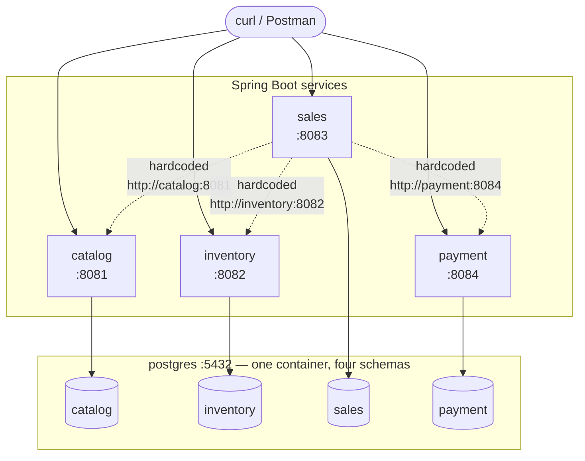
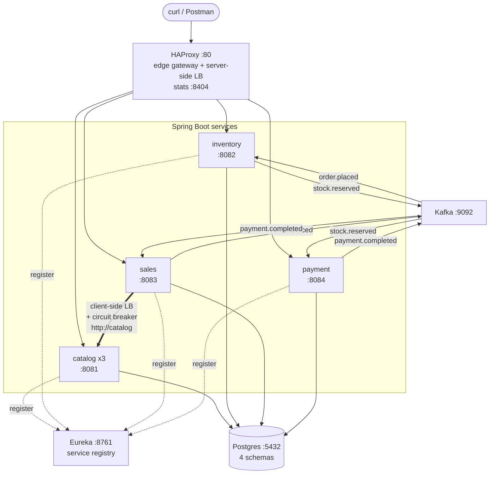
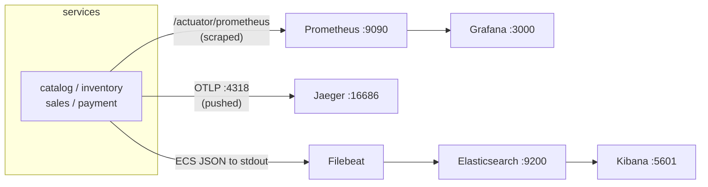
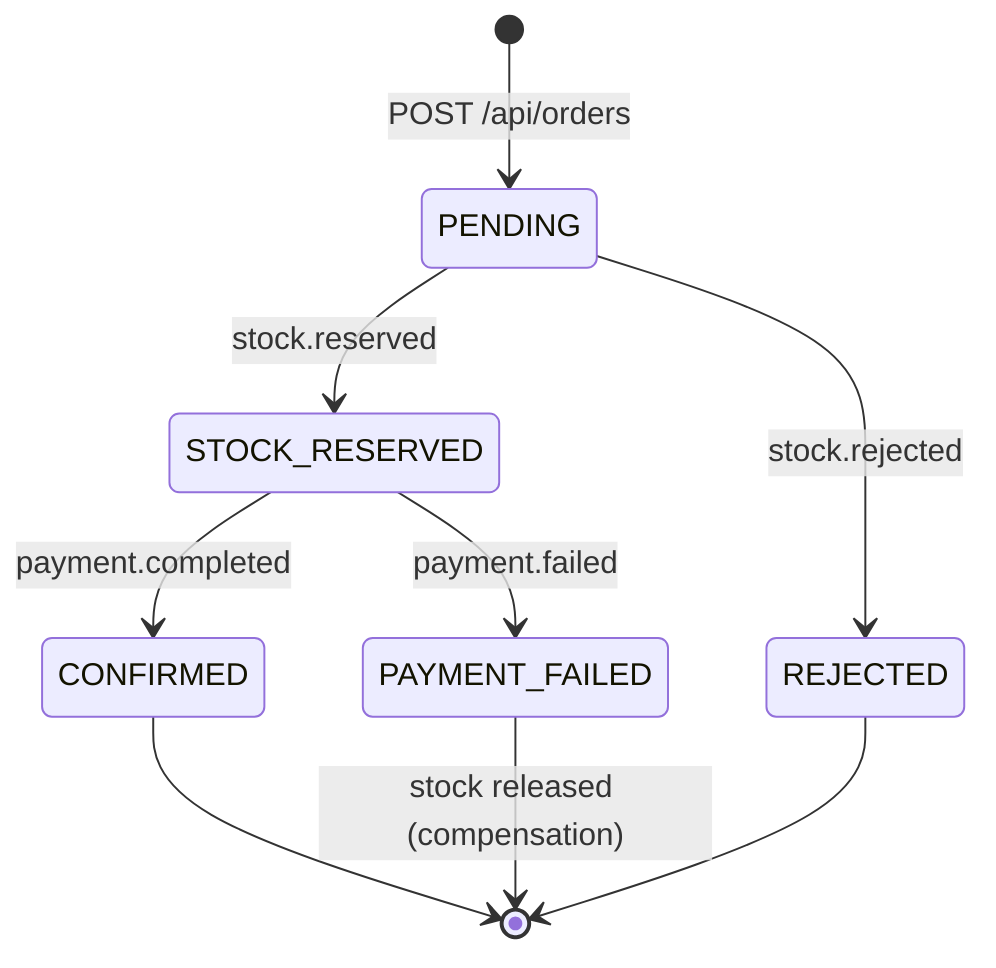
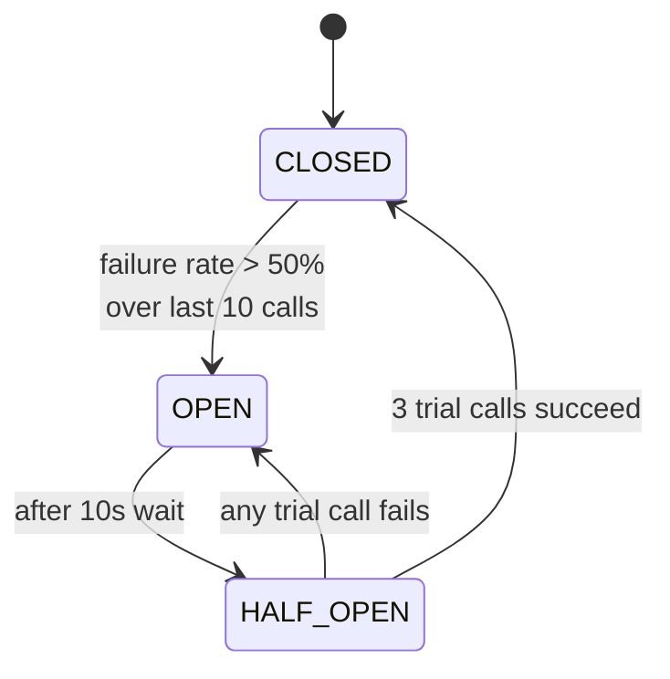
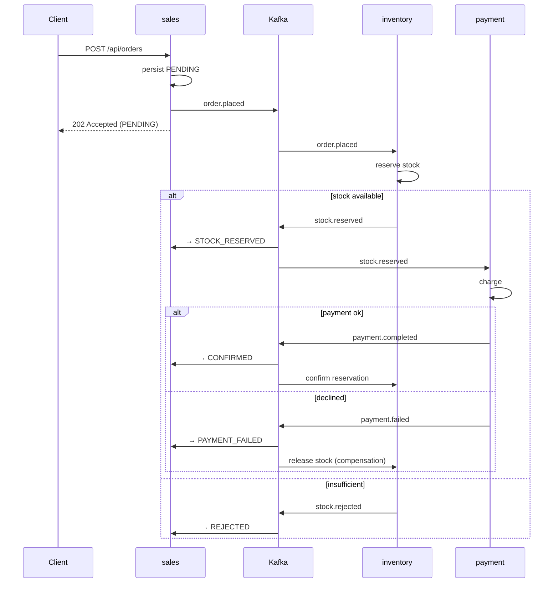

# Product Requirements Document
## Spring Boot Microservices — A Two-Phase Learning Project

| | |
|---|---|
| **Status** | Draft — approved for implementation |
| **Owner** | Jamal |
| **Created** | 2026-07-24 |
| **Scope** | Phase 1 (four Dockerized services) + Phase 2 (distributed-systems infrastructure) |
| **Repository** | `/home/jamal/Desktop/spring_boot/microservices` |

---

## 1. Overview

### 1.1 Problem statement

Microservice architecture is usually learned backwards. Tutorials hand you a finished `docker-compose.yml` with eighteen services in it, everything works on the first `up`, and you come away able to *copy* a setup but not to *explain* it. The concepts that actually matter in interviews and in production — why there are two load balancers in the request path, what a circuit breaker does when it is half-open, why services must not share tables — stay abstract because you never saw the system without them.

This project inverts that. It builds a small e-commerce system in two phases:

- **Phase 1** produces four plain Spring Boot services that talk to one Postgres and to each other in the simplest way that works. It deliberately contains problems: a hardcoded service URL, no resilience, no way to scale, no visibility into what is happening.
- **Phase 2** fixes each of those problems one at a time, and each fix is a lesson. You cannot appreciate service discovery until you have felt the pain of the hardcoded URL you wrote yourself in Phase 1.

### 1.2 Why this shape

The system models a real domain (catalog → inventory → sales → payment) because artificial `foo-service`/`bar-service` examples make the boundaries arbitrary. Here the boundaries are meaningful: it is obvious why payment should not read the products table, and that makes the data-ownership rules feel like consequences instead of arbitrary constraints.

Four services is the minimum that produces interesting behaviour. With two, everything is a point-to-point call. With four you get a multi-hop request path, a real event chain, and a reason to care about tracing.

### 1.3 Learning objectives

After **Phase 1** you should be able to explain and demonstrate:

1. How a Spring Boot service is layered (controller → service → repository → entity) and why DTOs exist at the boundary.
2. Why each service owns its own schema, and what breaks when they share one.
3. How schema migrations work with Flyway, and why `ddl-auto=update` is not acceptable beyond a toy.
4. How to containerize a JVM application with a multi-stage build, and why the build stage and runtime stage use different images.
5. How Docker Compose networking lets one container reach another by service name.
6. What is fragile about a service calling another service by a hardcoded URL.

After **Phase 2** you should be able to explain and demonstrate:

7. What a service registry stores, when instances register and deregister, and what happens during the gap.
8. The difference between **server-side** load balancing (HAProxy, at the edge) and **client-side** load balancing (Spring Cloud LoadBalancer, service-to-service) — and why a system typically has both.
9. Why an edge gateway needs dynamic backend resolution once you can scale a service to N replicas.
10. The three states of a circuit breaker, what causes each transition, and what a fallback should and should not do.
11. When to use asynchronous events instead of synchronous HTTP, and what a choreographed saga gives up in exchange (no distributed transaction, eventual consistency).
12. The three pillars of observability — metrics, traces, logs — what question each answers, and how a trace ID stitches them together.

### 1.4 Non-goals

Explicitly out of scope. Each of these is a legitimate topic; including them would dilute the ones above.

| Not doing | Why |
|---|---|
| Authentication / authorization | Security deserves its own phase; adding OAuth2 here obscures the networking lessons. |
| Kubernetes | Phase 2 teaches the *problems* (discovery, LB, health) that Kubernetes solves. Learn the problems first. |
| Production HA | Single Postgres, single Kafka broker, single Eureka. Replication is a separate topic. |
| Frontend / UI | The system is exercised with `curl` and the tool UIs (Kibana, Grafana, Jaeger, Eureka, HAProxy stats). |
| Cloud deployment | Everything runs on one machine via Docker Compose. |
| Spring Cloud Config / Bus | Centralized config is valuable but orthogonal; env vars are sufficient here. |
| Distributed transactions (2PC) | The saga pattern in Phase 2 is the deliberate alternative. |
| Comprehensive test suites | Some tests, but this is not a TDD exercise. |

### 1.5 Current state

The repository today contains four Spring Initializr skeletons and nothing else:

```
microservices/
├── catalog/     Spring Boot 4.1.0, Java 21, com.finalearth.catalog
├── inventory/   Spring Boot 4.1.0, Java 21, com.finalearth.inventory
├── sales/       Spring Boot 4.1.0, Java 21, com.finalearth.sales
└── payment/     Spring Boot 4.1.0, Java 21, com.finalearth.payment
```

Each has only `spring-boot-starter` and `spring-boot-starter-test` as dependencies, a single `*Application.java`, and an `application.properties` containing one line (`spring.application.name`). There is no git repository, no database, and no Docker configuration. Everything in this document is additive.

---

## 2. Architecture

### 2.1 Phase 1 — the naive system



Every client talks to a service directly on its own port. `sales` orchestrates an order by calling the other three synchronously over HTTP, using URLs written into configuration. If `catalog` is down, `sales` fails. If you start a second `catalog`, nothing routes to it.

**Read the dotted lines as debt.** They are the subject of Phase 2.

### 2.2 Phase 2 — the real system



And the observability tier, which every service feeds:



### 2.3 The request path, walked

A `POST /api/orders` in Phase 2 travels like this:

1. **Client → HAProxy (:80).** HAProxy matches the path `/api/orders` against an ACL and selects the `sales` backend. This is **server-side load balancing**: one shared component, outside the application, deciding where traffic goes. The client knows nothing about how many `sales` instances exist.
2. **HAProxy → a sales instance.** HAProxy resolves the backend through Docker's embedded DNS, so replicas that appeared after startup are already in the pool.
3. **sales → catalog.** `sales` needs to validate the product and read its price. It asks Spring Cloud LoadBalancer for an instance of `catalog`; LoadBalancer consults its locally cached copy of the Eureka registry, picks one of the three instances, and returns its address. This is **client-side load balancing**: the caller itself chooses, with no middleman in the path.
4. **The call is wrapped in a circuit breaker.** If `catalog` has been failing, the breaker is open and the call never leaves `sales` — a fallback runs instead.
5. **sales persists the order** as `PENDING` in its own schema and publishes `order.placed` to Kafka.
6. **The HTTP response returns** at this point. The order is accepted, not completed.

Steps 2 and 3 are the crux of section 5.4: **both** are load balancing, they operate at different layers, and they exist for different reasons.

### 2.4 The event path, walked

After `order.placed` lands on Kafka:

1. **inventory** consumes it, attempts to reserve stock, and publishes either `stock.reserved` or `stock.rejected`.
2. **payment** consumes `stock.reserved`, simulates a charge, and publishes `payment.completed` or `payment.failed`.
3. **sales** consumes the terminal events and moves the order to `CONFIRMED`, `REJECTED`, or `PAYMENT_FAILED`.
4. On failure, **inventory** consumes `payment.failed` and releases the reservation — the compensating action.

No service commands another. Each reacts to facts and publishes facts. This is **choreography**, and its cost is that the business outcome is only *eventually* consistent: for a brief window the order is `PENDING` and nobody knows how it ends.

---

## 3. Domain model and bounded contexts

### 3.1 Service ownership

| Service | Port | Schema | DB user | Tables | Owns |
|---|---|---|---|---|---|
| `catalog` | 8081 | `catalog` | `catalog_user` | `categories`, `products` | What is for sale and what it costs |
| `inventory` | 8082 | `inventory` | `inventory_user` | `stock_items`, `stock_movements` | How many units exist and are reserved |
| `sales` | 8083 | `sales` | `sales_user` | `orders`, `order_items` | Customer intent to buy |
| `payment` | 8084 | `payment` | `payment_user` | `payments` | Money movement |

In **Phase 2**, the three services that consume Kafka events — `inventory`, `sales`, `payment` — each gain one more table, `processed_events`, for idempotency (§3.3, §5.6). `catalog` consumes nothing and stays at two tables.

### 3.2 The most important rule in this document

> **There are no foreign keys across schemas.** `sales.order_items.product_id` is a plain `BIGINT`. It is not, and must never become, `REFERENCES catalog.products(id)`.

This looks like giving up something valuable — the database will no longer stop you from referencing a product that does not exist. That is exactly the point, and it is worth understanding why the trade is worth making:

- **A cross-schema FK is a hidden coupling.** It means `sales` cannot be deployed, migrated, or moved to a different database without coordinating with `catalog`. The two services are now one service wearing two hats.
- **It makes the boundary un-testable.** You can no longer run `sales` without a populated `catalog` schema.
- **It is a lie about the future.** In production these schemas would be separate database servers, possibly different engines. A constraint that cannot survive the architecture's own roadmap should not be written.

What replaces the FK is **validation at the boundary**: `sales` calls `catalog` to confirm the product exists before accepting the order. That call can fail, which is precisely why section 5.5 puts a circuit breaker around it. The database constraint you gave up becomes a distributed-systems problem you have to solve deliberately — and that is the lesson.

Each service's DB user is granted privileges **only on its own schema**, so this rule is enforced by Postgres rather than by discipline. An accidental `JOIN` across schemas fails with a permission error at development time.

### 3.3 Schema DDL

Written as Flyway migrations. Each service owns its own migration files under `src/main/resources/db/migration/`.

#### catalog

```sql
-- V1__create_categories.sql
CREATE TABLE categories (
    id          BIGSERIAL PRIMARY KEY,
    name        VARCHAR(100) NOT NULL UNIQUE,
    description VARCHAR(500),
    created_at  TIMESTAMPTZ  NOT NULL DEFAULT now()
);

-- V2__create_products.sql
CREATE TABLE products (
    id          BIGSERIAL PRIMARY KEY,
    sku         VARCHAR(50)  NOT NULL UNIQUE,
    name        VARCHAR(200) NOT NULL,
    description VARCHAR(1000),
    price       NUMERIC(12,2) NOT NULL CHECK (price >= 0),
    category_id BIGINT       NOT NULL REFERENCES categories(id),
    active      BOOLEAN      NOT NULL DEFAULT TRUE,
    created_at  TIMESTAMPTZ  NOT NULL DEFAULT now(),
    updated_at  TIMESTAMPTZ  NOT NULL DEFAULT now()
);

CREATE INDEX idx_products_category ON products(category_id);
CREATE INDEX idx_products_active   ON products(active) WHERE active = TRUE;
```

Note that `products.category_id` **is** a real foreign key — both tables live inside the `catalog` schema, owned by one service. Referential integrity within a boundary is good practice; it is only *across* boundaries that it becomes coupling.

#### inventory

```sql
-- V1__create_stock_items.sql
CREATE TABLE stock_items (
    id                 BIGSERIAL PRIMARY KEY,
    product_id         BIGINT      NOT NULL UNIQUE,  -- references catalog.products.id, NOT enforced
    quantity_available INTEGER     NOT NULL DEFAULT 0 CHECK (quantity_available >= 0),
    quantity_reserved  INTEGER     NOT NULL DEFAULT 0 CHECK (quantity_reserved  >= 0),
    version            BIGINT      NOT NULL DEFAULT 0,  -- JPA optimistic locking
    updated_at         TIMESTAMPTZ NOT NULL DEFAULT now()
);

-- V2__create_stock_movements.sql
CREATE TABLE stock_movements (
    id            BIGSERIAL PRIMARY KEY,
    stock_item_id BIGINT      NOT NULL REFERENCES stock_items(id),
    order_id      BIGINT,                            -- references sales.orders.id, NOT enforced
    movement_type VARCHAR(20) NOT NULL
                  CHECK (movement_type IN ('RESERVE','RELEASE','CONFIRM','RESTOCK')),
    quantity      INTEGER     NOT NULL,
    created_at    TIMESTAMPTZ NOT NULL DEFAULT now()
);

CREATE INDEX idx_movements_stock_item ON stock_movements(stock_item_id);
CREATE INDEX idx_movements_order      ON stock_movements(order_id);
```

`stock_movements` is an append-only audit log. It exists so that "how did this item reach this quantity?" is answerable — the kind of question that becomes urgent the first time a concurrency bug corrupts a count.

The `version` column enables JPA optimistic locking, which matters here: two concurrent reservations for the last unit in stock is the classic race, and this project will reproduce it in a lab.

#### sales

```sql
-- V1__create_orders.sql
CREATE TABLE orders (
    id           BIGSERIAL PRIMARY KEY,
    order_number VARCHAR(40)  NOT NULL UNIQUE,
    customer_id  BIGINT       NOT NULL,
    status       VARCHAR(20)  NOT NULL DEFAULT 'PENDING'
                 CHECK (status IN ('PENDING','STOCK_RESERVED','CONFIRMED',
                                   'REJECTED','PAYMENT_FAILED','CANCELLED')),
    total_amount NUMERIC(12,2) NOT NULL CHECK (total_amount >= 0),
    created_at   TIMESTAMPTZ  NOT NULL DEFAULT now(),
    updated_at   TIMESTAMPTZ  NOT NULL DEFAULT now()
);

CREATE INDEX idx_orders_customer ON orders(customer_id);
CREATE INDEX idx_orders_status   ON orders(status);

-- V2__create_order_items.sql
CREATE TABLE order_items (
    id         BIGSERIAL PRIMARY KEY,
    order_id   BIGINT        NOT NULL REFERENCES orders(id) ON DELETE CASCADE,
    product_id BIGINT        NOT NULL,   -- references catalog.products.id, NOT enforced
    product_name VARCHAR(200) NOT NULL,  -- denormalized snapshot, see note
    quantity   INTEGER       NOT NULL CHECK (quantity > 0),
    unit_price NUMERIC(12,2) NOT NULL CHECK (unit_price >= 0)
);

CREATE INDEX idx_order_items_order ON order_items(order_id);
```

`product_name` and `unit_price` are **copied** into `order_items` rather than looked up from `catalog` on read. This is deliberate denormalization and a second important lesson: an order is a historical record. If the price changes tomorrow, yesterday's order must still show yesterday's price. Storing a reference and joining at read time would silently rewrite history — and would also make `sales` unable to display an order while `catalog` is down.

#### payment

```sql
-- V1__create_payments.sql
CREATE TABLE payments (
    id             BIGSERIAL PRIMARY KEY,
    payment_ref    VARCHAR(40)  NOT NULL UNIQUE,
    order_id       BIGINT       NOT NULL,   -- references sales.orders.id, NOT enforced
    amount         NUMERIC(12,2) NOT NULL CHECK (amount > 0),
    status         VARCHAR(20)  NOT NULL DEFAULT 'PENDING'
                   CHECK (status IN ('PENDING','COMPLETED','FAILED','REFUNDED')),
    method         VARCHAR(20)  NOT NULL
                   CHECK (method IN ('CARD','BANK_TRANSFER','WALLET')),
    failure_reason VARCHAR(500),
    created_at     TIMESTAMPTZ  NOT NULL DEFAULT now(),
    updated_at     TIMESTAMPTZ  NOT NULL DEFAULT now()
);

CREATE UNIQUE INDEX idx_payments_order ON payments(order_id);
```

The unique index on `order_id` is the idempotency guard. Kafka delivers at-least-once, so `payment` **will** occasionally see the same `stock.reserved` event twice; the constraint makes the duplicate charge impossible at the database level rather than relying on application logic being correct.

Payment authorization is simulated — no real gateway. The rule: amounts ending in `.13` fail, everything else succeeds. Deterministic failure is essential for demonstrating circuit breakers and compensating transactions on demand.

#### processed_events — Phase 2 only

Added by a `V3__create_processed_events.sql` migration in **each of `inventory`, `sales`, and `payment`** when Kafka arrives (§5.6). Identical DDL in all three schemas; each service owns its own copy.

```sql
CREATE TABLE processed_events (
    event_id     UUID        PRIMARY KEY,
    event_type   VARCHAR(50) NOT NULL,
    processed_at TIMESTAMPTZ NOT NULL DEFAULT now()
);
```

The primary key **is** the mechanism: a consumer inserts the `event_id` inside the same transaction that applies the event's effect. A redelivery violates the key, the transaction rolls back, and the effect is not applied twice. Doing the check as a `SELECT` before the work instead would leave a race window between the check and the write — the constraint closes it.

This table only exists in Phase 2 because Phase 1 has no broker and therefore no redelivery to defend against. It is listed here rather than in §5.6 so the complete data model lives in one place.

### 3.4 Order status lifecycle



In Phase 1 there is no Kafka, so `sales` drives these transitions synchronously and the order reaches a terminal state before the HTTP response returns. In Phase 2 the same states are reached asynchronously. **The states do not change between phases — only who moves them and when.** That contrast is the clearest illustration in the project of what "eventual consistency" actually costs.

**One transition does not hold in Phase 1's trimmed API scope:** `PAYMENT_FAILED → [*]: stock released`. There is no `/api/stock/release` endpoint (§4.4), so in Phase 1 a `PAYMENT_FAILED` order is terminal with its stock still reserved (§4.5 step 6, §4.6). The release-as-compensation only actually happens in Phase 2, where it is internal logic inside `inventory`'s Kafka consumer (§5.6) — not a REST call, so it does not need a public endpoint.

---

## 4. Phase 1 requirements

**Goal:** four independently deployable services, backed by one Postgres, running under Docker Compose, exercising a complete order flow synchronously.

**Deliberately absent:** service discovery, load balancing, resilience, messaging, observability. Phase 1 should feel slightly uncomfortable by the end. That discomfort is the curriculum for Phase 2.

### 4.1 Dependencies to add

All four services get the same additions to `pom.xml`. Versions come from the `spring-boot-starter-parent` 4.1.0 BOM — do not pin them individually.

```xml
<dependency>
    <groupId>org.springframework.boot</groupId>
    <artifactId>spring-boot-starter-web</artifactId>
</dependency>
<dependency>
    <groupId>org.springframework.boot</groupId>
    <artifactId>spring-boot-starter-data-jpa</artifactId>
</dependency>
<dependency>
    <groupId>org.springframework.boot</groupId>
    <artifactId>spring-boot-starter-validation</artifactId>
</dependency>
<dependency>
    <groupId>org.springframework.boot</groupId>
    <artifactId>spring-boot-starter-actuator</artifactId>
</dependency>
<dependency>
    <groupId>org.flywaydb</groupId>
    <artifactId>flyway-core</artifactId>
</dependency>
<dependency>
    <groupId>org.flywaydb</groupId>
    <artifactId>flyway-database-postgresql</artifactId>
</dependency>
<dependency>
    <groupId>org.postgresql</groupId>
    <artifactId>postgresql</artifactId>
    <scope>runtime</scope>
</dependency>
```

`spring-boot-starter` (present in the skeletons) is a transitive dependency of `spring-boot-starter-web` and should be removed from each POM to keep the dependency list honest.

`flyway-database-postgresql` is a separate artifact from `flyway-core` in Flyway 10+; omitting it produces a confusing "Unsupported Database: PostgreSQL" error at startup despite the driver being present.

**Actuator is added in Phase 1 even though nothing scrapes it yet.** It provides `/actuator/health`, which Docker Compose health checks need immediately — and it means Phase 2's metrics work is configuration rather than a new dependency.

### 4.2 Package and layer conventions

Applied identically in all four services. Stated once here, not repeated per service.

```
com.finalearth.<service>
├── <Service>Application.java
├── config/          Spring @Configuration classes
├── controller/      @RestController — HTTP only, no business logic
├── service/         @Service — business logic, @Transactional boundaries
├── repository/      Spring Data JPA interfaces
├── entity/          @Entity — JPA-mapped, never leaves the service layer
├── dto/             request/response records — the public contract
├── mapper/          entity ↔ DTO conversion
├── client/          outbound calls to other services (sales only in Phase 1)
└── exception/       domain exceptions + @RestControllerAdvice
```

Rules that matter:

- **Entities never cross the controller boundary.** Controllers accept and return DTOs. Leaking a JPA entity into a response ties your wire format to your table layout and drags lazy-loading problems into JSON serialization.
- **DTOs are Java `record`s.** Immutable, compact, and validation annotations work on them normally.
- **`@Transactional` lives on the service layer**, never on controllers or repositories.
- **Every service has one `@RestControllerAdvice`** producing RFC 7807 `ProblemDetail` responses, so error shapes are consistent across services. Spring Boot 4 supports this natively via `ProblemDetail`.

### 4.3 Configuration convention

Each service's `application.properties` is written so that **every environment-specific value has an env-var override with a local-friendly default**. This is what makes the same jar run on the host and in Docker without a second config file.

```properties
spring.application.name=catalog
server.port=${SERVER_PORT:8081}

spring.datasource.url=jdbc:postgresql://${DB_HOST:localhost}:${DB_PORT:5432}/${DB_NAME:microservices}?currentSchema=catalog
spring.datasource.username=${DB_USER:catalog_user}
spring.datasource.password=${DB_PASSWORD:catalog_pass}

spring.jpa.hibernate.ddl-auto=validate
spring.jpa.open-in-view=false

spring.flyway.enabled=true
spring.flyway.schemas=catalog
spring.flyway.default-schema=catalog

management.endpoints.web.exposure.include=health,info,metrics
management.endpoint.health.show-details=always
```

Three settings deserve explanation:

- **`ddl-auto=validate`, not `update`.** Flyway owns the schema; Hibernate's job is only to confirm the entities match it. `update` is convenient and teaches nothing — it silently diverges environments, cannot express data migrations, and never drops anything.
- **`open-in-view=false`.** Spring's default is `true`, which holds a database connection open for the entire request and hides lazy-loading bugs until they surface under load. Turning it off makes `LazyInitializationException` appear at development time, where it is cheap to fix.
- **`currentSchema=catalog`** in the JDBC URL is what routes this service to its own schema without qualifying every table name.

### 4.4 REST API contracts

All endpoints are under `/api`. All responses are JSON. All errors use `ProblemDetail`.

**This is a trimmed learning scope, not the full contract a real system would need.** Each service exposes only the minimum required to demonstrate the order flow end-to-end: `catalog` has no public API at all — just one internal endpoint that only `sales` calls — and `inventory`/`sales`/`payment` each expose exactly one `GET` and one `POST`. Everything else in the domain model (categories, stock initialization, order listing, refunds, cancellation, audit trails) still exists as **DB tables and seed data** (§3.3, §4.8) — it is simply not reachable over HTTP in this build. Add those endpoints back later if a lab needs them; do not add them opportunistically.

#### catalog — :8081

| Method | Path | Purpose | Success | Errors |
|---|---|---|---|---|
| `GET` | `/api/products/{id}` | Single product, called only by `sales` to validate a product and read its price | 200 | 404 |

No other endpoint exists on `catalog` — no list, no create/update, no categories endpoint. Products and categories are inserted directly by `infra/postgres/seed.sql` (§4.8); there is no API path to create them. This single endpoint is not meant for external clients — it exists purely so `sales` can fetch pricing data at order time (§4.5).

```jsonc
// GET /api/products/1  →  200
{
  "id": 1,
  "sku": "LAPTOP-001",
  "name": "ThinkPad X1 Carbon",
  "description": "14 inch business laptop",
  "price": 1499.99,
  "categoryId": 1,
  "categoryName": "Electronics",
  "active": true,
  "createdAt": "2026-07-24T10:15:30Z"
}
```

#### inventory — :8082

| Method | Path | Purpose | Success | Errors |
|---|---|---|---|---|
| `GET` | `/api/stock/{productId}` | Current stock for a product | 200 | 404 |
| `POST` | `/api/stock/reserve` | Reserve units for an order | 200 | 400, 404, 409 (insufficient) |

Stock items are seeded directly by `infra/postgres/seed.sql` (§4.8) — there is no create endpoint. `reserve` is also final in this trimmed scope: there is no `release` or `confirm` endpoint, so a reservation is never explicitly rolled back or converted over HTTP (see the note in §4.5 step 6 and §4.6). `stock_movements` (the audit trail) is still written to on every reserve — the table and the write just have no corresponding read endpoint yet.

```jsonc
// POST /api/stock/reserve  →  200
// Request
{ "orderId": 42, "items": [ { "productId": 1, "quantity": 2 } ] }
// Response
{
  "orderId": 42,
  "status": "RESERVED",
  "reservations": [
    { "productId": 1, "quantity": 2, "quantityAvailable": 8 }
  ]
}
// On insufficient stock  →  409
{
  "type": "about:blank",
  "title": "Insufficient stock",
  "status": 409,
  "detail": "Product 1 has 1 unit available, 2 requested",
  "productId": 1
}
```

`reserve` decrements `quantity_available` and increments `quantity_reserved` in one transaction, writing a `stock_movements` row. It is **all-or-nothing across the item list** — a partially reserved order is not a valid state.

#### sales — :8083

| Method | Path | Purpose | Success | Errors |
|---|---|---|---|---|
| `POST` | `/api/orders` | Place an order | 201 + `Location` | 400, 402, 404, 409, 503 |
| `GET` | `/api/orders/{id}` | Order with items | 200 | 404 |

No list endpoint and no cancel endpoint in this trimmed scope — orders are looked up one at a time by ID.

```jsonc
// POST /api/orders  →  201
// Request
{
  "customerId": 100,
  "items": [ { "productId": 1, "quantity": 2 } ],
  "paymentMethod": "CARD"
}
// Response
{
  "id": 42,
  "orderNumber": "ORD-20260724-0042",
  "customerId": 100,
  "status": "CONFIRMED",
  "totalAmount": 2999.98,
  "items": [
    { "productId": 1, "productName": "ThinkPad X1 Carbon",
      "quantity": 2, "unitPrice": 1499.99 }
  ],
  "createdAt": "2026-07-24T10:20:00Z"
}
```

The client sends **only** `productId` and `quantity`. It does not send a price. `sales` fetches the authoritative price from `catalog` and computes the total server-side — a client-supplied price is an obvious tampering vector, and the rule "never trust the client for values you own" is worth establishing early.

#### payment — :8084

| Method | Path | Purpose | Success | Errors |
|---|---|---|---|---|
| `POST` | `/api/payments` | Process a payment | 201 | 400, 402 (declined), 409 (dup) |
| `GET` | `/api/payments/order/{orderId}` | Payment for an order | 200 | 404 |

No get-by-payment-id endpoint and no refund endpoint in this trimmed scope — a payment is always looked up through the order it belongs to.

```jsonc
// POST /api/payments  →  201
// Request
{ "orderId": 42, "amount": 2999.98, "method": "CARD" }
// Response
{
  "id": 7,
  "paymentRef": "PAY-20260724-0007",
  "orderId": 42,
  "amount": 2999.98,
  "status": "COMPLETED",
  "method": "CARD",
  "createdAt": "2026-07-24T10:20:01Z"
}
```

**Simulation rule:** an amount whose cents are exactly `.13` is declined with `402` and `failureReason: "Insufficient funds"`. Everything else succeeds. Deterministic, memorable, and it gives every later lab a reliable way to force the unhappy path.

### 4.5 The order flow in Phase 1

`POST /api/orders` executes synchronously inside `sales`:

1. Validate the request body (non-empty items, positive quantities).
2. For each item, `GET http://catalog:8081/api/products/{id}` → 404 from catalog becomes 404 from sales. (This is the one internal call to catalog's single endpoint, §4.4.)
3. Compute `totalAmount` from catalog's prices.
4. Persist the order as `PENDING` with its items (names and prices snapshotted).
5. `POST http://inventory:8082/api/stock/reserve` → on 409, mark `REJECTED` and return 409. This call is final — it permanently decrements `quantity_available` and increments `quantity_reserved`; there is no follow-up call.
6. `POST http://payment:8084/api/payments` → on 402, mark `PAYMENT_FAILED` and return 402. **Reserved stock is not released** — there is no `/api/stock/release` endpoint in this trimmed scope (§4.4), so a declined payment leaves the reservation in place. Accepted as a known limitation of a learning build; see §4.6.
7. Otherwise mark the order `CONFIRMED` and return 201. There is no separate inventory "confirm" call — the reservation from step 5 already is the final state.

### 4.6 The deliberate debt

Step 2 above uses a URL from configuration:

```properties
catalog.service.url=${CATALOG_URL:http://localhost:8081}
inventory.service.url=${INVENTORY_URL:http://localhost:8082}
payment.service.url=${PAYMENT_URL:http://localhost:8084}
```

Calls are made with `RestClient` (Spring's modern synchronous HTTP client — `RestTemplate` is legacy and should not be used in new code).

**This is intentionally the wrong design, and Phase 2 exists largely to dismantle it.** Before moving on, be able to state precisely what is wrong with it:

| Problem | Consequence |
|---|---|
| The address is static | Start a second `catalog` and no traffic reaches it. The config knows about one host. |
| No health awareness | If `catalog` is up but broken, `sales` keeps calling it and keeps failing. |
| Failure cascades | `catalog` down ⇒ every `POST /api/orders` fails. One service's outage becomes the whole system's outage. |
| No timeout budget | A slow `catalog` holds `sales` threads open until they exhaust. This is how one slow service takes down a healthy one. |
| Steps 4–7 are not atomic, and there is no compensating action | A crash between reserve and payment — or simply a declined payment (§4.5 step 6) — leaves stock reserved against an order that never completes. In this trimmed scope that is not just a crash scenario, it is the guaranteed outcome of every declined payment, since `/api/stock/release` does not exist. |

Section 5.1 fixes row 1, 5.4 fixes row 2, 5.5 fixes rows 3 and 4, and 5.6 fixes row 5.

### 4.7 Docker deployment

#### Per-service Dockerfile

Identical in all four services, changing only the exposed port.

```dockerfile
# ---- build stage ----
FROM maven:3.9-eclipse-temurin-21 AS build
WORKDIR /build
COPY pom.xml .
RUN mvn -B dependency:go-offline
COPY src ./src
RUN mvn -B clean package -DskipTests

# ---- runtime stage ----
FROM eclipse-temurin:21-jre-alpine
WORKDIR /app
RUN addgroup -S spring && adduser -S spring -G spring
COPY --from=build /build/target/*.jar app.jar
RUN chown spring:spring app.jar
USER spring
EXPOSE 8081
ENTRYPOINT ["java","-XX:MaxRAMPercentage=75.0","-jar","app.jar"]
```

Four things here are worth understanding rather than copying:

- **The two stages exist to keep Maven, the JDK, and the source tree out of the shipped image.** The build stage is ~800 MB; the runtime stage is ~180 MB. Only the second is deployed.
- **`pom.xml` is copied before `src`** so Docker's layer cache keeps the downloaded dependencies when only source changes. Copying everything at once re-downloads the internet on every code edit.
- **The runtime is a JRE, not a JDK**, and Alpine-based — smaller image, smaller attack surface.
- **`MaxRAMPercentage=75.0`** makes the JVM respect the container's memory limit. Without it the JVM can size its heap against the host's total RAM and get OOM-killed. This is the single most common JVM-in-Docker mistake.

**Note on Java versions:** the host has JDK 25 but the POMs target Java 21. The `java.version=21` property makes Maven compile with `--release 21`, which is correct on JDK 25 — but the images build on `eclipse-temurin-21` so container bytecode matches the declared target exactly.

#### Postgres initialization

`infra/postgres/init.sql`, mounted into `/docker-entrypoint-initdb.d/`, runs once on first startup of an empty volume:

```sql
CREATE SCHEMA IF NOT EXISTS catalog;
CREATE SCHEMA IF NOT EXISTS inventory;
CREATE SCHEMA IF NOT EXISTS sales;
CREATE SCHEMA IF NOT EXISTS payment;

CREATE USER catalog_user   WITH PASSWORD 'catalog_pass';
CREATE USER inventory_user WITH PASSWORD 'inventory_pass';
CREATE USER sales_user     WITH PASSWORD 'sales_pass';
CREATE USER payment_user   WITH PASSWORD 'payment_pass';

GRANT ALL PRIVILEGES ON SCHEMA catalog   TO catalog_user;
GRANT ALL PRIVILEGES ON SCHEMA inventory TO inventory_user;
GRANT ALL PRIVILEGES ON SCHEMA sales     TO sales_user;
GRANT ALL PRIVILEGES ON SCHEMA payment   TO payment_user;

-- Isolation: each user may touch only its own schema.
REVOKE ALL ON SCHEMA public FROM PUBLIC;
```

Passwords are plaintext because this never leaves a laptop. The PRD states this explicitly so nobody mistakes it for a pattern.

**The grants are the enforcement mechanism for section 3.2.** If `sales_user` tries to read `catalog.products`, Postgres refuses. The architectural rule is not a convention anyone has to remember — it is checked.

> **Gotcha:** `init.sql` runs *only* when the data volume is empty. After changing it you must `docker compose down -v` to drop the volume, otherwise the old schema silently persists and you debug the wrong thing.

#### docker-compose.yml (Phase 1)

```yaml
services:
  postgres:
    image: postgres:17-alpine
    environment:
      POSTGRES_DB: microservices
      POSTGRES_USER: postgres
      POSTGRES_PASSWORD: postgres
    ports: ["5432:5432"]
    volumes:
      - postgres_data:/var/lib/postgresql/data
      - ./infra/postgres/init.sql:/docker-entrypoint-initdb.d/init.sql:ro
    healthcheck:
      test: ["CMD-SHELL", "pg_isready -U postgres -d microservices"]
      interval: 10s
      timeout: 5s
      retries: 5
    networks: [backend]

  catalog:
    build: ./catalog
    environment:
      SERVER_PORT: 8081
      DB_HOST: postgres
      DB_USER: catalog_user
      DB_PASSWORD: catalog_pass
    ports: ["8081:8081"]
    depends_on:
      postgres: { condition: service_healthy }
    healthcheck:
      test: ["CMD","wget","-qO-","http://localhost:8081/actuator/health"]
      interval: 15s
      timeout: 5s
      retries: 5
      start_period: 40s
    networks: [backend]

  # inventory, payment: same shape on 8082 / 8084

  sales:
    build: ./sales
    environment:
      SERVER_PORT: 8083
      DB_HOST: postgres
      DB_USER: sales_user
      DB_PASSWORD: sales_pass
      CATALOG_URL: http://catalog:8081
      INVENTORY_URL: http://inventory:8082
      PAYMENT_URL: http://payment:8084
    ports: ["8083:8083"]
    depends_on:
      postgres:  { condition: service_healthy }
      catalog:   { condition: service_healthy }
      inventory: { condition: service_healthy }
      payment:   { condition: service_healthy }
    networks: [backend]

volumes:
  postgres_data:

networks:
  backend:
    driver: bridge
```

Points worth noticing:

- **`depends_on` with `condition: service_healthy`** waits for readiness, not merely for the container to exist. Plain `depends_on` only guarantees start order, which is why services that "randomly" fail on `docker compose up` usually just started before their database was accepting connections.
- **`start_period: 40s`** gives the JVM time to boot before failed health checks count against the retry budget.
- **`CATALOG_URL: http://catalog:8081`** works because Compose's embedded DNS resolves service names on the shared `backend` network. This is the mechanism Phase 2's HAProxy configuration also relies on.

### 4.8 Seed data

`infra/postgres/seed.sql`, applied manually (not on startup, so it can be re-run):

- 3 categories: Electronics, Books, Clothing
- 10 products across them, prices from 9.99 to 1499.99
- stock items for all 10, quantities between 0 and 100 — **including one product with quantity 0** and one with quantity 1, to make the insufficient-stock and race-condition paths reachable without setup.

**This is the only way categories/products/stock items enter the system in the trimmed §4.4 scope** — `catalog` has no create endpoint and `inventory` has no create endpoint, so seeding is not just convenience data here, it is required setup before anything in §4.5's order flow can be exercised.

### 4.9 Phase 1 acceptance criteria

Phase 1 is done when every one of these passes:

1. `docker compose up -d --build` brings 5 containers to `healthy` from a clean state (`docker compose down -v` first).
2. `docker compose ps` shows no restart loops after 2 minutes.
3. `curl localhost:8081/actuator/health` returns `{"status":"UP"}` — and likewise on 8082, 8083, 8084.
4. `curl localhost:8081/api/products/1` returns a seeded product. (There is no list endpoint in this trimmed scope — confirm all 10 seeded rows by querying `catalog.products` directly instead.)
5. `POST /api/orders` with a valid product and sufficient stock returns `201` with status `CONFIRMED`.
6. `GET /api/stock/{productId}` afterwards shows `quantity_available` decreased by the ordered quantity.
7. `POST /api/orders` with a **nonexistent** `productId` returns `404`, and no order row is written.
8. `POST /api/orders` for the quantity-0 product returns `409`, and the order is `REJECTED`.
9. `POST /api/orders` whose total ends in `.13` returns `402` and the order is `PAYMENT_FAILED`. **Stock stays reserved** — there is no release endpoint in this trimmed scope (§4.4, §4.5 step 6) — so `quantity_reserved` does **not** return to its prior value. Confirming that it stays reserved is the point of this criterion, not a bug to chase.
10. `docker compose stop catalog` then `POST /api/orders` fails. **This is expected.** Record the exact error and how long it takes to surface — Phase 2's circuit-breaker lab compares against this baseline.
11. Each service's Flyway history is present: `SELECT * FROM catalog.flyway_schema_history` shows 2 applied migrations.
12. Cross-schema isolation holds: connecting as `sales_user` and running `SELECT * FROM catalog.products` fails with a permission error.

Criteria 10 and 12 are the ones that matter most pedagogically — 10 captures the pain Phase 2 removes, and 12 proves the boundary is real rather than aspirational.

---

## 5. Phase 2 requirements

Each capability below follows the same five-part shape: **what** it is, **why** it exists (which Phase 1 problem it solves), **how** it is configured, **how to see it working**, and **acceptance criteria**. Build them in the order given — each depends on the previous.

### 5.0 Shared prerequisite: the Spring Cloud BOM

Every service that uses a Spring Cloud module needs the release train imported. **Spring Cloud 2025.1.2 ("Oakwood") is the train that matches Spring Boot 4.1.0** — it is based on Boot 4.0.7 and adds 4.1.0 compatibility. Mismatching the train against the Boot version is the most common cause of `NoSuchMethodError` at startup.

```xml
<properties>
    <java.version>21</java.version>
    <spring-cloud.version>2025.1.2</spring-cloud.version>
</properties>

<dependencyManagement>
    <dependencies>
        <dependency>
            <groupId>org.springframework.cloud</groupId>
            <artifactId>spring-cloud-dependencies</artifactId>
            <version>${spring-cloud.version}</version>
            <type>pom</type>
            <scope>import</scope>
        </dependency>
    </dependencies>
</dependencyManagement>
```

Never pin individual `spring-cloud-*` versions alongside the BOM.

---

### 5.1 Service discovery — Eureka

**What.** A registry where every service instance announces itself on startup and heartbeats to stay listed. Callers ask the registry "where is `catalog`?" and get back a live list of addresses.

**Why.** Phase 1 hardcoded `http://catalog:8081`. That address is a guess frozen into config: it cannot represent three instances, cannot notice a dead one, and must be edited whenever deployment changes. The registry replaces a static answer with a live one.

**How.** A new fifth module, `eureka-server/`, generated as a Spring Boot 4.1.0 project with `com.finalearth.eurekaserver`:

```xml
<dependency>
    <groupId>org.springframework.cloud</groupId>
    <artifactId>spring-cloud-starter-netflix-eureka-server</artifactId>
</dependency>
```

```java
@SpringBootApplication
@EnableEurekaServer
public class EurekaServerApplication {
    public static void main(String[] args) {
        SpringApplication.run(EurekaServerApplication.class, args);
    }
}
```

```properties
spring.application.name=eureka-server
server.port=8761

# A standalone registry must not try to register with, or fetch from, itself.
eureka.client.register-with-eureka=false
eureka.client.fetch-registry=false

# Learning-only: disables the protection mode that keeps stale
# instances listed during suspected network partitions. With it on,
# stopped services linger in the dashboard and confuse the exercise.
eureka.server.enable-self-preservation=false
eureka.server.eviction-interval-timer-in-ms=5000
```

All four business services add the client:

```xml
<dependency>
    <groupId>org.springframework.cloud</groupId>
    <artifactId>spring-cloud-starter-netflix-eureka-client</artifactId>
</dependency>
```

```properties
eureka.client.service-url.defaultZone=${EUREKA_URL:http://localhost:8761/eureka/}

# Register by IP: container hostnames are not resolvable from outside
# the container, so hostname-based registration breaks in Docker.
eureka.instance.prefer-ip-address=true

# Unique per instance — REQUIRED for scaling. Without it, three catalog
# replicas register under one ID and overwrite each other, so the
# registry only ever shows one.
eureka.instance.instance-id=${spring.application.name}:${random.uuid}

eureka.instance.lease-renewal-interval-in-seconds=10
eureka.instance.lease-expiration-duration-in-seconds=30
```

**The `instance-id` line is the single most important setting for section 5.3.** The default instance ID includes the hostname, and in a scaled Compose deployment that is *sometimes* unique and sometimes not, producing a registry that intermittently shows the wrong instance count.

**Timing you must understand.** Registration is not instant, and the delay is a real property of the pattern, not a bug:

| Step | Default | Configured here |
|---|---|---|
| Instance → registry heartbeat | 30 s | 10 s |
| Registry declares instance dead | 90 s | 30 s |
| Client refreshes its cached registry | 30 s | 10 s |

So a stopped service can remain in a caller's cache for tens of seconds. **This is why a circuit breaker (5.5) is not optional** — discovery alone will hand you addresses of dead instances.

**See it work.** Open `http://localhost:8761`. Four applications listed, each with instance count and status.

**Acceptance criteria.**
1. Eureka dashboard reachable at `:8761`, showing all four services `UP`.
2. `docker compose stop payment` → payment disappears from the dashboard within ~40 s.
3. `docker compose start payment` → it reappears within ~20 s.
4. `GET localhost:8761/eureka/apps` returns registry XML listing every instance.

---

### 5.2 Edge gateway and server-side load balancing — HAProxy

**What.** One entry point on port 80. HAProxy inspects the request path, chooses a backend, and forwards. Clients stop knowing service ports entirely.

**Why.** Phase 1 exposed four ports and made the caller responsible for knowing that orders live on 8083. That is an internal detail leaking outward: it blocks re-arranging services, and it means cross-cutting concerns (TLS, rate limits, access logging) would have to be implemented four times.

**How.** `infra/haproxy/haproxy.cfg`:

```haproxy
global
    log stdout format raw local0 info
    maxconn 4096

defaults
    log     global
    mode    http
    option  httplog
    option  dontlognull
    timeout connect 5s
    timeout client  30s
    timeout server  30s
    retries 3

# Docker's embedded DNS. This is what makes scaling work without
# editing this file — see section 5.3.
resolvers docker
    nameserver dns1 127.0.0.11:53
    resolve_retries       3
    timeout resolve       1s
    timeout retry         1s
    hold valid            5s
    hold other            5s
    hold refused          5s
    hold nx               5s
    hold timeout          5s

frontend api_gateway
    bind *:80

    # Propagate the caller's identity to the backend.
    option forwardfor
    http-request set-header X-Forwarded-Proto http

    acl is_catalog   path_beg /api/products
    acl is_inventory path_beg /api/stock
    acl is_sales     path_beg /api/orders
    acl is_payment   path_beg /api/payments

    use_backend catalog_backend   if is_catalog
    use_backend inventory_backend if is_inventory
    use_backend sales_backend     if is_sales
    use_backend payment_backend   if is_payment

    default_backend sales_backend

backend catalog_backend
    balance roundrobin
    option httpchk GET /actuator/health
    http-check expect status 200
    # Up to 5 slots resolved from DNS at runtime. init-addr none lets
    # HAProxy start even when zero instances exist yet.
    server-template catalog 5 catalog:8081 check resolvers docker init-addr none

backend inventory_backend
    balance roundrobin
    option httpchk GET /actuator/health
    http-check expect status 200
    server-template inventory 5 inventory:8082 check resolvers docker init-addr none

backend sales_backend
    balance roundrobin
    option httpchk GET /actuator/health
    http-check expect status 200
    server-template sales 5 sales:8083 check resolvers docker init-addr none

backend payment_backend
    balance roundrobin
    option httpchk GET /actuator/health
    http-check expect status 200
    server-template payment 5 payment:8084 check resolvers docker init-addr none

listen stats
    bind *:8404
    stats enable
    stats uri /
    stats refresh 5s
```

Compose service:

```yaml
  haproxy:
    image: haproxy:3.0-alpine
    ports: ["80:80", "8404:8404"]
    volumes:
      - ./infra/haproxy/haproxy.cfg:/usr/local/etc/haproxy/haproxy.cfg:ro
    depends_on: [catalog, inventory, sales, payment]
    networks: [backend]
```

**Why `server-template` and not `server` lines.** A static `server catalog1 catalog:8081 check` resolves the hostname **once, at startup**, and pins that IP forever. Scale to three replicas and HAProxy keeps hammering the first one — and if that container is replaced, it fails permanently against a dead IP. `server-template` pre-creates N slots and re-resolves them against the `resolvers` section on the `hold` interval, so replicas started later are picked up automatically. The `5` is a ceiling: you cannot scale beyond it without editing the file.

**`option httpchk` is what makes this a load balancer rather than a splitter.** Without health checks HAProxy will happily route a third of your traffic into a crashed container.

**See it work.** `http://localhost:8404` — the stats page shows every backend, every slot, its health, and a live request count per server.

**Acceptance criteria.**
1. `curl localhost/api/products/1` returns catalog data through port 80.
2. `curl localhost/api/orders -d '{...}'` places an order through port 80.
3. Stats page at `:8404` shows 4 backends, each with at least one `UP` server and the unused template slots as `DOWN`/`MAINT`.
4. `docker compose stop inventory` → that backend turns red in stats within ~10 s, and `curl localhost/api/stock/1` returns `503` from HAProxy rather than hanging.

---

### 5.3 Scaling a service to N instances

**What.** Run three `catalog` containers from the same image and have traffic spread across them.

**Why.** This is the payoff for 5.1 and 5.2, and the fastest way to discover which parts of a design secretly assume a single instance.

**How.** One change is required first: **remove the fixed host port binding from any service you intend to scale.**

```yaml
  catalog:
    build: ./catalog
    # ports: ["8081:8081"]   ← DELETE. Blocks scaling.
    expose: ["8081"]
```

Two containers cannot both bind host port 8081; Compose fails with a port-conflict error. `expose` publishes the port on the internal network only — which is all HAProxy needs, and which is the correct posture anyway once there is a gateway.

```bash
docker compose up -d --scale catalog=3
```

**What to observe, in order:**

1. **Eureka** (`:8761`) now lists `CATALOG` with 3 instances, each with a distinct instance ID. If you see one instance, `eureka.instance.instance-id` from 5.1 is wrong.
2. **HAProxy stats** (`:8404`) shows three green servers in `catalog_backend`, filled into template slots without any config change.
3. **Traffic distribution:**
   ```bash
   for i in $(seq 1 30); do curl -s localhost/api/products/1 > /dev/null; done
   ```
   The stats page shows the session count split roughly evenly.
4. **Which instance answered.** With only one endpoint on `catalog` in this trimmed scope (§4.4), don't add a new one just to observe this — watch container logs instead, the same way §5.4 does:
   ```bash
   docker compose logs -f catalog | grep "GET /api/products"
   ```
   Each replica's own log stream shows only the requests HAProxy routed to it.

**The lesson underneath.** Scaling only works because `catalog` is **stateless** — no session state, no in-memory cache that must agree across instances, all state in Postgres. Any of those would break under scaling in ways that are hard to diagnose. This is the practical meaning of "design for horizontal scale".

**Acceptance criteria.**
1. `docker compose up -d --scale catalog=3` starts three containers with no port conflict.
2. Eureka shows exactly 3 `CATALOG` instances with distinct IDs.
3. HAProxy stats shows 3 `UP` servers in `catalog_backend`.
4. 30 requests distribute across all three (no server at 0).
5. `docker compose stop <one catalog container>` → HAProxy marks it `DOWN`, requests continue succeeding on the other two with **zero client-visible errors**.
6. `docker compose up -d --scale catalog=1` scales back down cleanly.

---

### 5.4 Client-side load balancing — Spring Cloud LoadBalancer

**What.** When `sales` calls `catalog`, `sales` itself picks the instance — using its cached copy of the Eureka registry — and connects directly. No proxy in the path.

**Why there are now two load balancers.** This is the question this architecture provokes most reliably, so it gets a direct answer:

| | HAProxy (5.2) | Spring Cloud LoadBalancer (5.4) |
|---|---|---|
| Type | Server-side | Client-side |
| Sits | In the request path, as a hop | Inside the calling application |
| Used for | **North–south** traffic: outside → in | **East–west** traffic: service → service |
| Knows instances via | Docker DNS | Eureka registry |
| Who it protects | External clients from internal topology | Callers from having to know callee addresses |
| Extra network hop | Yes | No |
| Fails how | Single shared component; its outage is total | Per-caller; degrades independently |

The short version: **HAProxy exists so the outside world sees one door. LoadBalancer exists so internal calls skip the doorman.** Routing every internal call through HAProxy would double the hop count on every service-to-service request and make the gateway a bottleneck and a single point of failure for traffic that never needed to leave the network.

**How.** `spring-cloud-starter-loadbalancer` arrives transitively with the Eureka client. Register a load-balanced `RestClient.Builder`:

```java
@Configuration
public class RestClientConfig {

    @Bean
    @LoadBalanced
    public RestClient.Builder loadBalancedRestClientBuilder() {
        return RestClient.builder();
    }

    @Bean
    public RestClient catalogClient(RestClient.Builder builder) {
        return builder.baseUrl("http://catalog").build();  // service name, not host:port
    }
}
```

`http://catalog` is not a hostname. The `@LoadBalanced` interceptor intercepts it, treats `catalog` as a **service ID**, asks Eureka for instances, picks one (round-robin by default), and rewrites the URL to the real address before the request goes out.

Delete the Phase 1 properties — `catalog.service.url`, `inventory.service.url`, `payment.service.url`. **Their removal is the deliverable.** The address is no longer configuration; it is a runtime lookup.

**A caching subtlety worth knowing.** LoadBalancer serves from a locally cached registry snapshot refreshed on `eureka.client.registry-fetch-interval-seconds` (10 s here). Immediately after an instance dies, the cache still lists it and calls will fail. That window is unavoidable in any discovery system and is exactly what 5.5 covers.

**See it work.** Scale `catalog` to 3, place several orders, and watch the logs of all three catalog containers:

```bash
docker compose logs -f catalog | grep "GET /api/products"
```

Requests appear across all three, without HAProxy involved.

**Acceptance criteria.**
1. No hardcoded service URLs remain anywhere in `sales` (grep for `http://catalog:` returns nothing).
2. Orders still succeed end-to-end.
3. With `catalog` scaled to 3, repeated orders hit all three catalog instances.
4. Stopping one catalog instance leaves order placement working (after the registry cache refreshes).

---

### 5.5 Circuit breaker — Resilience4j

**What.** A stateful wrapper around a remote call. It counts failures; past a threshold it stops attempting the call entirely and fails fast, then probes periodically to see whether the dependency recovered.

**Why.** Phase 1 acceptance criterion 10 established the baseline: with `catalog` stopped, every order request hangs until timeout and then fails. Worse, each hanging request holds a `sales` thread — enough of them and `sales` stops serving *any* request, including ones that never needed `catalog`. **One service's outage becomes the entire system's outage.** That is a cascading failure, and it is what circuit breakers prevent.

**The three states.**



- **CLOSED** — normal. Calls pass through, outcomes are recorded.
- **OPEN** — tripped. Calls fail immediately without a network attempt. This is the point: failing in 1 ms protects the caller far better than failing in 30 s.
- **HALF_OPEN** — probing. A few trial calls are allowed; success closes the breaker, failure re-opens it. This is what prevents a recovering service from being flattened by the full resumed load.

**How.**

```xml
<dependency>
    <groupId>org.springframework.cloud</groupId>
    <artifactId>spring-cloud-starter-circuitbreaker-resilience4j</artifactId>
</dependency>
```

```properties
resilience4j.circuitbreaker.instances.catalog.sliding-window-type=COUNT_BASED
resilience4j.circuitbreaker.instances.catalog.sliding-window-size=10
resilience4j.circuitbreaker.instances.catalog.minimum-number-of-calls=5
resilience4j.circuitbreaker.instances.catalog.failure-rate-threshold=50
resilience4j.circuitbreaker.instances.catalog.wait-duration-in-open-state=10s
resilience4j.circuitbreaker.instances.catalog.permitted-number-of-calls-in-half-open-state=3
resilience4j.circuitbreaker.instances.catalog.automatic-transition-from-open-to-half-open-enabled=true
resilience4j.circuitbreaker.instances.catalog.register-health-indicator=true

# Time budget. Without this the breaker never sees a slow call as a
# failure — it just waits, which is the failure mode being prevented.
resilience4j.timelimiter.instances.catalog.timeout-duration=3s

resilience4j.retry.instances.catalog.max-attempts=3
resilience4j.retry.instances.catalog.wait-duration=500ms
resilience4j.retry.instances.catalog.enable-exponential-backoff=true

# Same block repeated for the `inventory` and `payment` instances.
```

`minimum-number-of-calls=5` prevents a single early failure from tripping the breaker on a 1-in-1 failure rate — a real trap in low-traffic systems.

Usage:

```java
@Service
public class CatalogClient {

    private final RestClient catalogRestClient;
    private final CircuitBreakerFactory<?, ?> circuitBreakerFactory;

    public ProductDto getProduct(Long id) {
        return circuitBreakerFactory.create("catalog").run(
            () -> catalogRestClient.get()
                    .uri("/api/products/{id}", id)
                    .retrieve()
                    .body(ProductDto.class),
            throwable -> fallback(id, throwable)
        );
    }

    private ProductDto fallback(Long id, Throwable t) {
        log.warn("catalog circuit open, falling back for product {}", id, t);
        throw new ServiceUnavailableException("Catalog unavailable, try again shortly");
    }
}
```

**Fallback design is a decision, not boilerplate.** The rule:

- **`catalog` unavailable** → fail the order with `503`. You cannot invent a price. **A wrong fallback is worse than an error.**
- **`inventory` unavailable** → fail with `503`. Accepting an order you cannot fulfil creates a business problem, not a technical one.
- **A hypothetical recommendations service** → return an empty list. Degraded but useful.

The distinguishing question is: *is this dependency essential to correctness, or merely to completeness?* Only the second kind gets a graceful fallback. This project's dependencies are all the first kind, and saying so explicitly is more valuable than manufacturing a fake graceful degradation.

**Retry ordering matters.** Resilience4j applies `Retry` **outside** `CircuitBreaker` by default, so a retried call sees the open breaker and fails fast rather than re-attempting the network. Reversing that order means every logical call becomes 3 network calls and you trip the breaker three times faster than intended.

**See it work.** The failure drill:

```bash
# 1. Baseline — succeeds, breaker CLOSED
curl localhost/api/orders -X POST -H 'Content-Type: application/json' \
  -d '{"customerId":100,"items":[{"productId":1,"quantity":1}],"paymentMethod":"CARD"}'
curl -s localhost:8083/actuator/health | jq '.components.circuitBreakers'

# 2. Kill the dependency
docker compose stop catalog

# 3. Five requests — first few slow (real timeouts), then instant
for i in $(seq 1 6); do
  time curl -s -o /dev/null -w "%{http_code}\n" -X POST localhost/api/orders \
    -H 'Content-Type: application/json' \
    -d '{"customerId":100,"items":[{"productId":1,"quantity":1}],"paymentMethod":"CARD"}'
done

# 4. Breaker is now OPEN
curl -s localhost:8083/actuator/health | jq '.components.circuitBreakers'

# 5. Recover, wait past wait-duration-in-open-state, watch HALF_OPEN → CLOSED
docker compose start catalog
```

**The measurement that makes the lesson land:** in step 3, the first calls take ~3 s (the time limiter) and later ones return in **single-digit milliseconds**. Compare against Phase 1 criterion 10. Same outage, three orders of magnitude difference in how the system absorbs it.

**Acceptance criteria.**
1. `/actuator/health` exposes circuit-breaker state per instance.
2. With `catalog` stopped, the breaker moves `CLOSED → OPEN` within 5–6 requests.
3. Once `OPEN`, requests fail in <50 ms instead of ~3 s.
4. After restarting `catalog` and waiting 10 s, the breaker goes `HALF_OPEN` then `CLOSED`, and orders succeed again — with no restart of `sales`.
5. `sales` remains responsive on `GET /api/orders/{id}` throughout the `catalog` outage. **This is the actual goal:** the outage stayed contained.

---

### 5.6 Asynchronous messaging — Kafka

**What.** Replace the synchronous reserve → pay → confirm chain with events on a log. `sales` publishes a fact and returns; the rest happens as consumers react.

**Why.** Phase 1's order flow makes four blocking calls before responding. It is slow (latencies add up), fragile (any hop down fails the order), and **not atomic** — a crash between reserve and payment strands reserved stock forever, with no compensating action. There is no distributed transaction available across four databases; a saga is the alternative.

**The trade being made, stated plainly.** Synchronous gave you an immediate, authoritative answer. Asynchronous gives you resilience and decoupling, and takes away the immediate answer. `POST /api/orders` now returns `202 Accepted` with status `PENDING`. The client must poll or subscribe. **If that is unacceptable to the business, events are the wrong tool** — this is a design trade, not an upgrade.

**Topics.**

| Topic | Producer | Consumers | Partitions | Key |
|---|---|---|---|---|
| `order.placed` | sales | inventory | 3 | `orderId` |
| `stock.reserved` | inventory | payment, sales | 3 | `orderId` |
| `stock.rejected` | inventory | sales | 3 | `orderId` |
| `payment.completed` | payment | sales, inventory | 3 | `orderId` |
| `payment.failed` | payment | sales, inventory | 3 | `orderId` |

**Keying by `orderId` is not decorative.** Kafka guarantees ordering only *within* a partition, and the key decides the partition. Keying by `orderId` guarantees all events for one order are processed in order, while different orders still spread across partitions for parallelism. Key by something else and you can process `payment.completed` before `stock.reserved`.

**Payload** — every event carries the same envelope:

```jsonc
{
  "eventId": "d4f8...",          // UUID, for idempotency
  "eventType": "order.placed",
  "occurredAt": "2026-07-24T10:20:00Z",
  "orderId": 42,
  "payload": {
    "customerId": 100,
    "totalAmount": 2999.98,
    "items": [ { "productId": 1, "quantity": 2, "unitPrice": 1499.99 } ]
  }
}
```

**The saga.**



Notice there is no coordinator. Each service reacts to facts and emits facts — **choreography**. The alternative, orchestration (a central saga coordinator issuing commands), is easier to follow and easier to debug but reintroduces a component that knows about everyone. Choreography is chosen here because it makes the decoupling visible; the trade-off deserves a paragraph in `docs/architecture.md`.

**Idempotency is mandatory, not optional.** Kafka is at-least-once: every consumer **will** eventually see a duplicate. Each consuming service keeps a `processed_events` table (DDL in §3.3) and inserts the `event_id` in the same transaction that applies the event — a redelivery hits the primary key, rolls back, and changes nothing. Without this, a redelivered `stock.reserved` charges the customer twice. The `payments.order_id` unique index from §3.3 is the second line of defence, making a double charge impossible even if the idempotency check itself is buggy.

**How.**

```xml
<dependency>
    <groupId>org.springframework.kafka</groupId>
    <artifactId>spring-kafka</artifactId>
</dependency>
```

```properties
spring.kafka.bootstrap-servers=${KAFKA_BROKERS:localhost:9092}

# Producer: acks=all + idempotence = no silent loss, no duplicates from retries
spring.kafka.producer.acks=all
spring.kafka.producer.retries=3
spring.kafka.producer.properties.enable.idempotence=true
spring.kafka.producer.key-serializer=org.apache.kafka.common.serialization.StringSerializer
spring.kafka.producer.value-serializer=org.springframework.kafka.support.serializer.JsonSerializer

# Consumer: manual acks so offsets commit only after the DB transaction
spring.kafka.consumer.group-id=${spring.application.name}
spring.kafka.consumer.auto-offset-reset=earliest
spring.kafka.consumer.enable-auto-commit=false
spring.kafka.listener.ack-mode=manual_immediate
spring.kafka.consumer.properties.spring.json.trusted.packages=com.finalearth.*
```

**`enable-auto-commit=false` is the correctness-critical line.** With auto-commit, Kafka marks a message consumed on a timer — so a crash mid-processing loses the event permanently. Manual acknowledgement after the transaction commits converts that into at-least-once delivery, which idempotency then makes safe.

Broker, in KRaft mode — no ZooKeeper:

```yaml
  kafka:
    image: apache/kafka:3.8.0
    ports: ["9092:9092"]
    environment:
      KAFKA_NODE_ID: 1
      KAFKA_PROCESS_ROLES: broker,controller
      KAFKA_LISTENERS: PLAINTEXT://:9092,CONTROLLER://:9093
      KAFKA_ADVERTISED_LISTENERS: PLAINTEXT://kafka:9092
      KAFKA_CONTROLLER_QUORUM_VOTERS: 1@kafka:9093
      KAFKA_CONTROLLER_LISTENER_NAMES: CONTROLLER
      KAFKA_OFFSETS_TOPIC_REPLICATION_FACTOR: 1
      KAFKA_TRANSACTION_STATE_LOG_REPLICATION_FACTOR: 1
      KAFKA_GROUP_INITIAL_REBALANCE_DELAY_MS: 0
    networks: [backend]
```

**Consumer groups and scaling — the exercise.** Scale `inventory` to 3. All three share `group-id=inventory`, so Kafka assigns each one partition of `order.placed` and each event is handled exactly once by the group. Then scale to 5: two consumers sit idle, because **partition count caps useful consumer parallelism**. That surprises people, and seeing it directly is worth more than reading it.

**See it work.**
```bash
docker compose exec kafka /opt/kafka/bin/kafka-console-consumer.sh \
  --bootstrap-server localhost:9092 --topic order.placed --from-beginning

docker compose exec kafka /opt/kafka/bin/kafka-consumer-groups.sh \
  --bootstrap-server localhost:9092 --describe --group inventory
```
The second command shows partition assignment and **consumer lag** — the single most important operational metric for a queue-based system.

**Acceptance criteria.**
1. `POST /api/orders` returns `202` with status `PENDING`.
2. Within ~2 s, `GET /api/orders/{id}` shows `CONFIRMED`.
3. The console consumer shows all five event types flowing for a successful order.
4. An order totalling `.13` ends `PAYMENT_FAILED` **and** stock is released — verify `quantity_reserved` returned to its prior value.
5. `docker compose stop payment`, place an order, restart payment → the order still reaches `CONFIRMED`. **Events waited in the log; nothing was lost.** This is the property synchronous calls do not have.
6. Replaying a duplicate event (re-send by hand) does not double-charge — idempotency holds.
7. With `inventory` scaled to 3, `kafka-consumer-groups --describe` shows one partition assigned per consumer.

---

### 5.7 Metrics — Prometheus and Grafana

**What.** Every service exposes numeric time series; Prometheus scrapes and stores them; Grafana draws them.

**Why.** Metrics answer *"is the system healthy, and how is it trending?"* — aggregate questions, cheap to store, ideal for alerts. They cannot tell you why one specific request was slow. That is 5.8's job.

**How.**

```xml
<dependency>
    <groupId>io.micrometer</groupId>
    <artifactId>micrometer-registry-prometheus</artifactId>
    <scope>runtime</scope>
</dependency>
```

```properties
management.endpoints.web.exposure.include=health,info,metrics,prometheus
management.metrics.tags.application=${spring.application.name}

# Latency percentiles and histogram buckets for HTTP requests.
management.metrics.distribution.percentiles-histogram.http.server.requests=true
management.metrics.distribution.percentiles.http.server.requests=0.5,0.95,0.99
```

`management.metrics.tags.application` is what makes a scaled deployment legible — without a common tag you cannot aggregate three `catalog` instances into one line on a graph.

`infra/prometheus/prometheus.yml`:

```yaml
global:
  scrape_interval: 10s

scrape_configs:
  - job_name: 'spring-services'
    metrics_path: '/actuator/prometheus'
    # DNS-based discovery. Docker's DNS returns every replica's A record,
    # so scaled instances are scraped automatically.
    dns_sd_configs:
      - names: ['catalog']
        type: A
        port: 8081
      - names: ['inventory']
        type: A
        port: 8082
      - names: ['sales']
        type: A
        port: 8083
      - names: ['payment']
        type: A
        port: 8084

  - job_name: 'haproxy'
    static_configs:
      - targets: ['haproxy:8404']
```

**Static targets are the trap here.** `static_configs: ['catalog:8081']` resolves to one IP and scrapes exactly one of your three replicas — so your dashboard shows a third of reality while looking entirely plausible. `dns_sd_configs` re-resolves each scrape interval and produces one target per replica.

**Metrics that matter.** The four "golden signals", plus JVM basics:

| Signal | Query |
|---|---|
| Traffic | `rate(http_server_requests_seconds_count[1m])` |
| Errors | `rate(http_server_requests_seconds_count{status=~"5.."}[1m])` |
| Latency (p95) | `histogram_quantile(0.95, rate(http_server_requests_seconds_bucket[5m]))` |
| Saturation | `jvm_memory_used_bytes / jvm_memory_max_bytes` |
| Breaker state | `resilience4j_circuitbreaker_state` |
| Kafka lag | `kafka_consumer_fetch_manager_records_lag_max` |

**Grafana** on `:3000` (`admin`/`admin`), provisioned from `infra/grafana/provisioning/` so dashboards survive `docker compose down -v`. Three dashboards: **Service Overview** (golden signals per service), **JVM** (heap, GC, threads), **Resilience** (breaker state transitions, Kafka lag).

**Acceptance criteria.**
1. `curl localhost:8081/actuator/prometheus` returns metrics in exposition format.
2. Prometheus `:9090` → Status → Targets shows every service `UP`.
3. With `catalog` scaled to 3, Prometheus lists **3 separate targets** for catalog.
4. Grafana renders all three dashboards with live data.
5. Load-generate, then confirm the p95 latency panel responds.
6. Trip the circuit breaker (5.5) and watch `resilience4j_circuitbreaker_state` change on the Resilience dashboard.

---

### 5.8 Distributed tracing — Jaeger

**What.** Every request gets a trace ID that propagates across HTTP calls and Kafka messages. Each unit of work is a span. Jaeger reassembles them into one timeline.

**Why.** With four services and a broker, "the order was slow" is unanswerable from logs alone — you would grep four services and guess at correlation. A trace shows the whole path with per-hop timing, and makes the slow hop obvious rather than inferred.

**How.** Spring Boot 4 collapses this into one starter:

```xml
<dependency>
    <groupId>org.springframework.boot</groupId>
    <artifactId>spring-boot-starter-opentelemetry</artifactId>
</dependency>
```

```properties
management.opentelemetry.tracing.export.otlp.endpoint=${OTLP_ENDPOINT:http://localhost:4318/v1/traces}

# Boot samples 10% by default. For learning you want every request.
# In production this would be far lower — tracing is not free.
management.tracing.sampling.probability=1.0

# Put trace IDs into log lines so logs and traces can be joined (5.9).
logging.pattern.correlation=[${spring.application.name:},%X{traceId:-},%X{spanId:-}]
```

Jaeger v2 accepts OTLP natively — no separate OpenTelemetry Collector is needed:

```yaml
  jaeger:
    image: jaegertracing/jaeger:2.2.0
    ports:
      - "16686:16686"   # UI
      - "4318:4318"     # OTLP/HTTP
      - "4317:4317"     # OTLP/gRPC
    networks: [backend]
```

**Context propagation across Kafka is the interesting part.** Over HTTP, Spring injects a `traceparent` header automatically. Across a broker there is no request to attach to — the trace context must ride in the **message headers** and be extracted by the consumer. Spring Kafka's observability support handles this once `spring.kafka.template.observation-enabled=true` and `spring.kafka.listener.observation-enabled=true` are set. Without them the trace **breaks at the broker** and you get two disconnected traces instead of one — a very common and very confusing failure.

**See it work.** Place an order, open `http://localhost:16686`, select service `sales`, find the trace. Expect a waterfall spanning `sales` → Kafka → `inventory` → Kafka → `payment` → back to `sales`, with each span's duration visible.

**Acceptance criteria.**
1. Jaeger UI lists all four services.
2. A single order produces **one** trace covering every service it touched.
3. Kafka-mediated spans are in the same trace as the originating HTTP request — not a separate one.
4. Span durations are visible per hop and identify the slowest.
5. A failed order produces a trace with the erroring span marked.
6. The trace ID in the response/logs finds the exact trace in Jaeger.

---

### 5.9 Log aggregation — Filebeat, Elasticsearch, Kibana

**What.** Services log structured JSON to stdout; Filebeat ships Docker's captured stdout to Elasticsearch; Kibana searches it.

**Why.** With four services and multiple replicas, `docker compose logs` is unusable — no cross-service correlation, gone on restart, no query language. Centralizing makes "show me every ERROR in the last hour across all services, for this one trace" a single query.

**Why there is no Logstash.** Spring Boot 4 emits Elastic Common Schema JSON natively, so there is nothing to parse:

```properties
logging.structured.format.console=ecs
logging.structured.ecs.service.name=${spring.application.name}
logging.structured.ecs.service.environment=docker
```

Logstash exists to parse unstructured text into fields. When the application already emits correctly-shaped JSON, inserting Logstash adds a container, ~1 GB of RAM, and a Grok config that is a classic source of silent failures — in exchange for nothing. **Structured logging at the source beats parsing at the destination.**

Output looks like:

```json
{"@timestamp":"2026-07-24T10:20:00.123Z","log.level":"INFO",
 "service.name":"sales","trace.id":"a1b2c3","span.id":"d4e5f6",
 "message":"Order 42 placed","log.logger":"com.finalearth.sales.service.OrderService"}
```

**`trace.id` in every line is the payoff.** It arrives automatically from MDC, which the starter in 5.8 populates — which is what lets you pivot from a Kibana log line straight to the Jaeger trace.

`infra/filebeat/filebeat.yml`:

```yaml
filebeat.inputs:
  - type: container
    paths:
      - '/var/lib/docker/containers/*/*.log'
    json.keys_under_root: true
    json.overwrite_keys: true
    json.add_error_key: true

processors:
  - add_docker_metadata: ~
  - drop_event:
      when:
        not:
          has_fields: ['service.name']   # keep app logs, drop infra noise

output.elasticsearch:
  hosts: ['elasticsearch:9200']
  index: "microservices-%{+yyyy.MM.dd}"

setup.ilm.enabled: false
setup.template.name: "microservices"
setup.template.pattern: "microservices-*"
```

```yaml
  elasticsearch:
    image: docker.elastic.co/elasticsearch/elasticsearch:8.15.0
    environment:
      - discovery.type=single-node
      - xpack.security.enabled=false          # learning only
      - "ES_JAVA_OPTS=-Xms512m -Xmx512m"      # cap it, or it eats the machine
    ports: ["9200:9200"]
    networks: [backend]

  kibana:
    image: docker.elastic.co/kibana/kibana:8.15.0
    environment:
      - ELASTICSEARCH_HOSTS=http://elasticsearch:9200
    ports: ["5601:5601"]
    depends_on: [elasticsearch]
    networks: [backend]

  filebeat:
    image: docker.elastic.co/beats/filebeat:8.15.0
    user: root
    volumes:
      - ./infra/filebeat/filebeat.yml:/usr/share/filebeat/filebeat.yml:ro
      - /var/lib/docker/containers:/var/lib/docker/containers:ro
      - /var/run/docker.sock:/var/run/docker.sock:ro
    depends_on: [elasticsearch]
    networks: [backend]
```

**The three-pillar workflow**, which is the actual point of sections 5.7–5.9:

1. **Grafana** — a p95 latency alert fires. *Something is wrong.* (metrics)
2. **Jaeger** — find a slow trace; the `inventory` span took 4 s. *Where it is wrong.* (traces)
3. **Kibana** — search that `trace.id`; find `inventory`'s ERROR line about a lock timeout. *Why it is wrong.* (logs)

No pillar answers all three questions. Running the whole path once, deliberately, is worth more than any amount of reading about it.

**Acceptance criteria.**
1. Kibana reachable at `:5601`; a `microservices-*` data view is creatable.
2. Log entries from all four services appear with `service.name` populated.
3. Filtering `log.level: ERROR` returns only errors.
4. Searching a `trace.id` returns lines from **every** service that request touched.
5. That same trace ID resolves in Jaeger — logs and traces join.
6. With `catalog` scaled to 3, logs from all three replicas arrive, distinguishable by container metadata.

---

## 6. Cross-cutting specifications

### 6.1 Version matrix

Pin these. Version drift between Spring Boot and Spring Cloud is the most common source of startup failures that look like application bugs.

| Component | Version | Notes |
|---|---|---|
| Spring Boot | **4.1.0** | Already set in all four skeleton POMs |
| Spring Cloud | **2025.1.2** (Oakwood) | The train for Boot 4.1.0 — see §5.0 |
| Java | **21** | `java.version=21`; host JDK 25 compiles this fine via `--release 21` |
| Maven wrapper | 3.9.16 | Already present in each service |
| PostgreSQL | 17-alpine | |
| HAProxy | 3.0-alpine | `server-template` + `resolvers` required |
| Apache Kafka | 3.8.0 (`apache/kafka`) | KRaft mode — no ZooKeeper |
| Prometheus | latest stable | |
| Grafana | latest stable | |
| Jaeger | 2.x | v2 ingests OTLP directly; v1 needs `COLLECTOR_OTLP_ENABLED=true` |
| Elasticsearch / Kibana / Filebeat | 8.15.0 | **All three must match exactly** |

Spring Cloud artifacts used, all resolved from the 2025.1.2 BOM: `spring-cloud-starter-netflix-eureka-server`, `spring-cloud-starter-netflix-eureka-client` (Netflix 5.0.2), `spring-cloud-starter-loadbalancer` (Commons 5.0.2), `spring-cloud-starter-circuitbreaker-resilience4j` (Circuitbreaker 5.0.2).

### 6.2 Port allocation

| Port | Component | Phase | Exposed to host? |
|---|---|---|---|
| 80 | HAProxy — the front door | 2 | Yes |
| 3000 | Grafana | 2 | Yes |
| 4317 | Jaeger OTLP/gRPC | 2 | Yes |
| 4318 | Jaeger OTLP/HTTP | 2 | Yes |
| 5432 | PostgreSQL | 1 | Yes |
| 5601 | Kibana | 2 | Yes |
| 8081 | catalog | 1 | **Phase 1 only** — must be unpublished to scale (§5.3) |
| 8082 | inventory | 1 | Yes |
| 8083 | sales | 1 | Yes |
| 8084 | payment | 1 | Yes |
| 8404 | HAProxy stats | 2 | Yes |
| 8761 | Eureka dashboard | 2 | Yes |
| 9090 | Prometheus | 2 | Yes |
| 9092 | Kafka | 2 | Yes |
| 9093 | Kafka controller | 2 | No (internal) |
| 9200 | Elasticsearch | 2 | Yes |
| 16686 | Jaeger UI | 2 | Yes |

Once Phase 2 is complete, **all application traffic should go through port 80**. The individual service ports stay published only so you can inspect `/actuator/*` directly while learning.

### 6.3 Compose profiles

The full stack is too heavy to run constantly (§10.1). Profiles let you bring up only what a given lab needs.

```yaml
  prometheus:
    profiles: ["observability"]
  grafana:
    profiles: ["observability"]
  jaeger:
    profiles: ["observability"]
  elasticsearch:
    profiles: ["logging"]
  kibana:
    profiles: ["logging"]
  filebeat:
    profiles: ["logging"]
```

Services with no `profiles` key always start.

```bash
docker compose up -d                                    # core only  (~3 GB)
docker compose --profile observability up -d            # + metrics & traces  (~4.5 GB)
docker compose --profile observability --profile logging up -d   # everything  (~7 GB)
```

### 6.4 Spring profiles

Two: the default (local development against `localhost`) and `docker`. Because §4.3 gives every environment-specific value an env-var override with a sensible local default, `docker` carries almost nothing — the Compose `environment:` blocks do the work. This is deliberate: one artifact, configured by environment, is the twelve-factor property that makes the same jar runnable anywhere.

---

## 7. Repository layout

Target state after both phases. The four existing service directories stay exactly where they are.

```
microservices/
├── README.md
├── docker-compose.yml
├── .env.example                      # ports, passwords, image tags
├── .gitignore
│
├── catalog/                          # exists — gains src, Dockerfile
│   ├── src/main/java/com/finalearth/catalog/
│   │   ├── config/ controller/ service/ repository/
│   │   ├── entity/ dto/ mapper/ exception/
│   │   └── CatalogApplication.java
│   ├── src/main/resources/
│   │   ├── application.properties
│   │   └── db/migration/V1__create_categories.sql, V2__create_products.sql
│   ├── Dockerfile
│   └── pom.xml
│
├── inventory/                        # same shape
├── sales/                            # same shape + client/ package
├── payment/                          # same shape
│
├── eureka-server/                    # NEW in Phase 2
│   ├── src/main/java/com/finalearth/eurekaserver/
│   ├── Dockerfile
│   └── pom.xml
│
├── infra/
│   ├── postgres/init.sql, seed.sql
│   ├── haproxy/haproxy.cfg
│   ├── prometheus/prometheus.yml
│   ├── grafana/provisioning/{datasources,dashboards}/
│   └── filebeat/filebeat.yml
│
├── docs/
│   ├── PRD.md                        # this document
│   ├── architecture.md
│   ├── troubleshooting.md
│   ├── glossary.md
│   └── labs/
│       ├── 01-first-run.md
│       ├── 02-service-discovery.md
│       ├── 03-scaling-and-load-balancing.md
│       ├── 04-circuit-breaker.md
│       ├── 05-event-driven-saga.md
│       ├── 06-metrics-and-dashboards.md
│       ├── 07-distributed-tracing.md
│       └── 08-log-aggregation.md
│
└── scripts/
    ├── smoke-test.sh                 # runs every acceptance criterion
    ├── load-test.sh                  # generates traffic for dashboards
    └── break-catalog.sh              # circuit-breaker failure drill
```

**No parent aggregator POM.** Each service builds independently, which is how microservices actually deploy — a shared parent quietly recreates the coupling the architecture is meant to remove. The cost is repeated dependency blocks across four POMs; that repetition is honest.

---

## 8. Documentation deliverables

This is a learning project, so the documentation is a deliverable, not an afterthought.

| Document | Purpose |
|---|---|
| `README.md` | Orientation: what this is, how to run it, where to go next |
| `docs/PRD.md` | This document — requirements and rationale |
| `docs/architecture.md` | Diagrams plus the decision record: why Eureka over Consul, why choreography over orchestration, why no Logstash, why no shared parent POM. Each decision gets context / choice / alternatives / consequences |
| `docs/labs/NN-*.md` | The core learning artifact — see below |
| `docs/troubleshooting.md` | Symptom → cause → fix, accumulated while building |
| `docs/glossary.md` | Section 11, extracted for standalone reference |

### The labs

One per Phase 2 capability, each following the same structure:

1. **Concept** — what this solves, in plain language, before any code.
2. **Observe the problem** — run commands that make the pain concrete *before* the fix exists.
3. **Apply the fix** — the configuration or code, with the reasoning.
4. **Verify** — commands proving it worked.
5. **Break it deliberately** — misconfigure it on purpose and see the failure mode. *(This is the step most tutorials omit, and the one that produces real understanding.)*
6. **Questions to answer** — self-check prompts. If you cannot answer them, re-read step 1.

Step 5 is not optional. Knowing that `eureka.instance.instance-id` must be unique is trivia; having watched three replicas collapse into one registry entry because it was not, and recognizing that symptom later, is knowledge.

---

## 9. Milestones

### Phase 1

| # | Milestone | Exit criteria |
|---|---|---|
| **M1** | Domain and persistence | All four services start against local Postgres; Flyway migrations applied; entities validate against the schema (`ddl-auto=validate` passes) |
| **M2** | REST APIs | Every endpoint in §4.4 implemented with validation and `ProblemDetail` errors; testable via curl |
| **M3** | Inter-service flow + Docker | `sales` orchestrates the full order via `RestClient`; `docker compose up` passes **all 12 criteria in §4.9** |

**Do not start Phase 2 until §4.9 criterion 10 has been observed personally.** The Phase 2 labs are written as responses to that failure.

### Phase 2

| # | Milestone | Exit criteria |
|---|---|---|
| **M4** | Service discovery | `eureka-server` running; all four services registered; §5.1 criteria pass |
| **M5** | Gateway + scaling | HAProxy serving on :80; `catalog` scaled to 3 with even distribution; §5.2 and §5.3 criteria pass |
| **M6** | Client-side LB | Hardcoded URLs gone from `sales`; internal calls resolve via Eureka; §5.4 criteria pass |
| **M7** | Circuit breaker | Breaker trips and recovers on demand; `sales` survives a `catalog` outage; §5.5 criteria pass |
| **M8** | Event-driven saga | Kafka running; order flow asynchronous; compensation works; §5.6 criteria pass |
| **M9** | Observability | Prometheus + Grafana + Jaeger + ELK running; the three-pillar workflow in §5.9 completed end-to-end; §5.7–5.9 criteria pass |

M4–M7 are sequential (each builds on the last). M8 can be done before M9, but M9 is far more instructive with events already flowing — a trace that spans a broker is the interesting case.

---

## 10. Risks and constraints

### 10.1 Memory — the binding constraint

| Component | Approx. RAM |
|---|---|
| 4 services (or 6 with scaling) | 350 MB each → ~1.4–2.1 GB |
| eureka-server | 300 MB |
| PostgreSQL | 200 MB |
| Kafka | 1.0 GB |
| Elasticsearch | 1.5 GB (capped to 512 MB heap) |
| Kibana | 600 MB |
| Prometheus + Grafana + Jaeger + Filebeat | ~800 MB |
| HAProxy | 50 MB |
| **Total** | **~7–8 GB** |

**8 GB of RAM is the practical floor and will be tight; 16 GB is comfortable.** Mitigations, in order of preference: use Compose profiles (§6.3) so the logging tier is down unless you are working on it; cap Elasticsearch heap via `ES_JAVA_OPTS`; set `MaxRAMPercentage` on services; scale replicas back to 1 when not exercising scaling.

### 10.2 Known traps

Each of these will cost hours if hit unprepared. They belong in `docs/troubleshooting.md` as they are encountered.

| Trap | Symptom | Fix |
|---|---|---|
| `init.sql` only runs on an empty volume | Schema changes appear ignored | `docker compose down -v` before `up` |
| Eureka `instance-id` not unique | 3 replicas show as 1 instance | Set `eureka.instance.instance-id` (§5.1) |
| Fixed host port + `--scale` | `port is already allocated` | Replace `ports:` with `expose:` (§5.3) |
| HAProxy `server` instead of `server-template` | New replicas get no traffic | Use `server-template` + `resolvers` (§5.2) |
| Prometheus `static_configs` | Only one replica scraped | Use `dns_sd_configs` (§5.7) |
| Kafka observation disabled | Trace breaks at the broker | Enable producer/listener observation (§5.8) |
| Trace sampling left at default | Most requests missing from Jaeger | `management.tracing.sampling.probability=1.0` |
| Elasticsearch `vm.max_map_count` | ES exits immediately on Linux | `sudo sysctl -w vm.max_map_count=262144` (persist in `/etc/sysctl.conf`) |
| JVM DNS caching | Stale IPs after container restart | `-Dnetworkaddress.cache.ttl=30`; largely moot once Eureka is in play |
| `depends_on` without `condition` | Services start before Postgres is ready | Use `service_healthy` (§4.7) |
| Flyway on PostgreSQL | "Unsupported Database" despite the driver | Add `flyway-database-postgresql` (§4.1) |
| Elastic version skew | Filebeat silently indexes nothing | Match ES/Kibana/Filebeat exactly (§6.1) |

### 10.3 Scope risks

- **Feature creep.** Config server, API versioning, Kubernetes, OAuth2 will all look tempting mid-build. They are listed in §1.4 as non-goals for a reason; each roughly doubles the remaining work.
- **Building before understanding.** Getting all of Phase 2 running without doing the labs produces a working stack you cannot explain — which is precisely the failure mode described in §1.1.
- **Skipping Phase 1's discomfort.** Jumping straight to the finished architecture removes the contrast the whole design depends on.

---

## 11. Glossary

Terms defined as they are used in this project, not in full generality.

**Actuator** — Spring Boot's operational endpoints (`/actuator/health`, `/actuator/prometheus`). The interface between your app and the ops tooling.

**At-least-once delivery** — Kafka's guarantee: a message will be delivered, possibly more than once. Why consumers must be idempotent (§5.6).

**Bounded context** — A boundary within which a model has one consistent meaning. Here, one per service; "product" means something slightly different to catalog than to sales, and that is fine because they do not share a table.

**Choreography** — Saga coordination where each service reacts to events without a central controller. Contrast **orchestration**, where one component issues commands. §5.6.

**Circuit breaker** — A wrapper that stops calling a failing dependency after a failure threshold, failing fast instead. States: CLOSED, OPEN, HALF_OPEN. §5.5.

**Client-side load balancing** — The caller picks the target instance itself using a registry. No proxy hop. §5.4.

**Compensating transaction** — The undo action in a saga. Releasing reserved stock after a failed payment. Not a rollback — the original action really happened.

**Consumer group** — Kafka consumers sharing a group ID. Partitions are divided among them, so each message is processed once per group. Caps parallelism at the partition count.

**ECS (Elastic Common Schema)** — A standard field naming convention for logs (`service.name`, `log.level`, `trace.id`). Spring Boot 4 emits it natively. §5.9.

**Eventual consistency** — The system converges on a correct state, but not immediately. The price of asynchronous messaging.

**Golden signals** — Traffic, errors, latency, saturation. The four metrics worth alerting on first.

**Idempotency** — Processing the same message twice has the same effect as once. Mandatory under at-least-once delivery.

**Instance ID** — A service instance's unique key in the registry. Must be unique per instance or scaling silently breaks. §5.1.

**Lag (consumer lag)** — How many messages a consumer group is behind the log head. The primary health metric for event-driven systems.

**MDC (Mapped Diagnostic Context)** — Per-thread key/value data automatically added to log lines. How `trace.id` gets into every log statement.

**OTLP** — OpenTelemetry Protocol, the wire format for exporting traces. Jaeger v2 accepts it directly. §5.8.

**Optimistic locking** — Concurrency control via a `version` column: the update fails if the row changed since it was read. Used on `stock_items`.

**Saga** — A sequence of local transactions across services, with compensating actions on failure. The alternative to a distributed transaction. §5.6.

**Scrape** — Prometheus pulling metrics from a target. Pull-based, not push — which is why Prometheus needs to discover targets (§5.7).

**Self-preservation (Eureka)** — Protection mode where Eureka stops evicting instances when it loses many heartbeats at once, assuming a network partition rather than mass failure. Disabled here because it makes learning exercises confusing.

**Server-side load balancing** — A shared component in the request path distributing traffic. HAProxy. §5.2.

**Service discovery** — Finding a service's current network location at runtime rather than from static config. §5.1.

**Span** — One timed unit of work inside a trace. One HTTP handler, one DB query.

**`server-template` (HAProxy)** — Directive pre-creating N backend slots filled from DNS at runtime, so replicas are picked up without a config reload. §5.2.

**Trace / trace ID** — The full causal path of one request across services, and the identifier tying its spans together. Also embedded in logs, which is what joins the three pillars.

**Three pillars of observability** — Metrics (is something wrong?), traces (where?), logs (why?). No one pillar answers all three.

---

## Appendix A — Quick reference

```bash
# Phase 1
docker compose down -v && docker compose up -d --build
curl localhost:8081/actuator/health

# Phase 2 — core
docker compose up -d --scale catalog=3

# Phase 2 — everything
docker compose --profile observability --profile logging up -d --scale catalog=3

# Place an order (through the gateway)
curl -X POST localhost/api/orders -H 'Content-Type: application/json' \
  -d '{"customerId":100,"items":[{"productId":1,"quantity":2}],"paymentMethod":"CARD"}'
```

| UI | URL | Credentials |
|---|---|---|
| HAProxy stats | http://localhost:8404 | — |
| Eureka | http://localhost:8761 | — |
| Prometheus | http://localhost:9090 | — |
| Grafana | http://localhost:3000 | admin / admin |
| Jaeger | http://localhost:16686 | — |
| Kibana | http://localhost:5601 | — |
